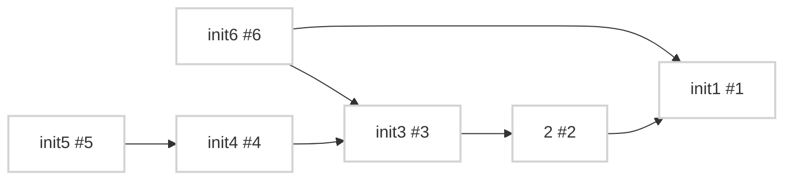

- [#6](https://github.com/kaaaaakun/issue_to_mermaid/issues/6): init6
- [#5](https://github.com/kaaaaakun/issue_to_mermaid/issues/5): init5
- [#4](https://github.com/kaaaaakun/issue_to_mermaid/issues/4): init4
- [#3](https://github.com/kaaaaakun/issue_to_mermaid/issues/3): init3
- [#2](https://github.com/kaaaaakun/issue_to_mermaid/issues/2): 2
- [#1](https://github.com/kaaaaakun/issue_to_mermaid/issues/1): init1